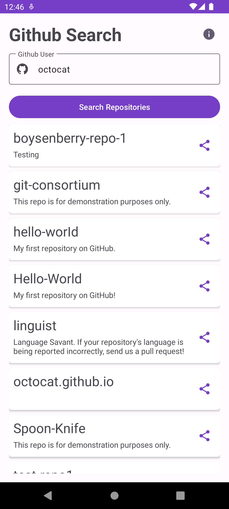
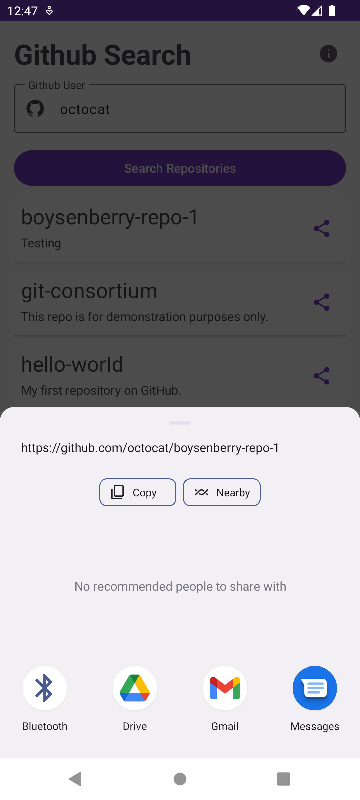
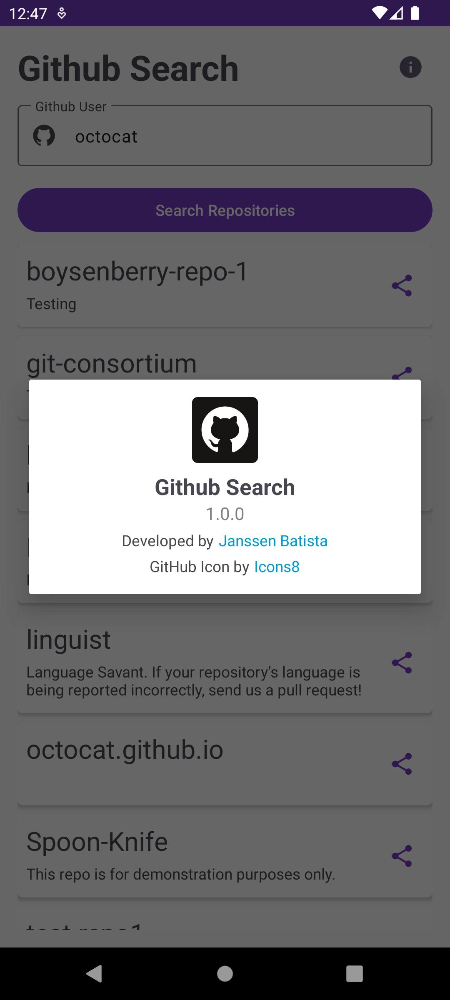
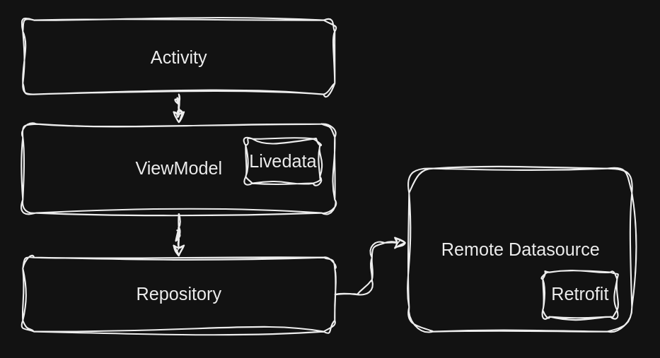

# Github Search

<p>App to find and share repositories of a user in Github</p>

<h3 id="screen">📸 Screenshots</p>

<div style="display: flex; justify-content: start; gap: 20px">
	  
    
    

### 📐 App Architecture - MVVM (Model-View-ViewModel)

Architectural pattern used in Android app development. It's a design pattern that separates an app's user interface (UI) into three main components, each with a specific role:

1. **Model:** The Model represents the data and the business logic of the application. It is responsible for data manipulation, retrieval from data sources (such as databases or web services), and any other data-related operations. The Model doesn't have direct knowledge of the UI.
2. **View:** The View represents the UI elements of the application, which include everything the user interacts with, such as buttons, text fields, and images. In the MVVM pattern, the View is responsible for displaying data and capturing user input. Unlike the Model and ViewModel, the View does not contain application logic.
3. **ViewModel:** The ViewModel is an intermediary between the Model and the View. It is responsible for exposing data to the View and handling user interactions from the View. The ViewModel contains the presentation logic and prepares the data from the Model for display in the View. It also allows for decoupling the UI from the underlying data and business logic.

<div style="display: flex; align-items:start ">
    
</div>

### 📄 License

```bash
MIT License

Copyright (c) 2023 Janssen Batista

Permission is hereby granted, free of charge, to any person obtaining a copy
of this software and associated documentation files (the "Software"), to deal
in the Software without restriction, including without limitation the rights
to use, copy, modify, merge, publish, distribute, sublicense, and/or sell
copies of the Software, and to permit persons to whom the Software is
furnished to do so, subject to the following conditions:

The above copyright notice and this permission notice shall be included in all
copies or substantial portions of the Software.

THE SOFTWARE IS PROVIDED "AS IS", WITHOUT WARRANTY OF ANY KIND, EXPRESS OR
IMPLIED, INCLUDING BUT NOT LIMITED TO THE WARRANTIES OF MERCHANTABILITY,
FITNESS FOR A PARTICULAR PURPOSE AND NONINFRINGEMENT. IN NO EVENT SHALL THE
AUTHORS OR COPYRIGHT HOLDERS BE LIABLE FOR ANY CLAIM, DAMAGES OR OTHER
LIABILITY, WHETHER IN AN ACTION OF CONTRACT, TORT OR OTHERWISE, ARISING FROM,
OUT OF OR IN CONNECTION WITH THE SOFTWARE OR THE USE OR OTHER DEALINGS IN THE
SOFTWARE.
```

